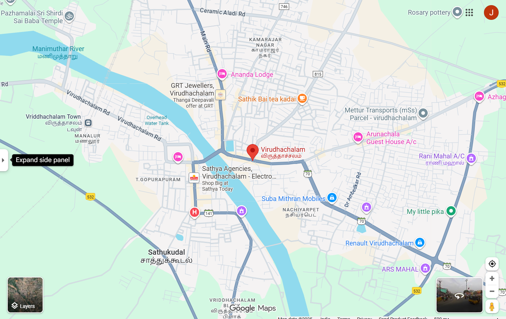
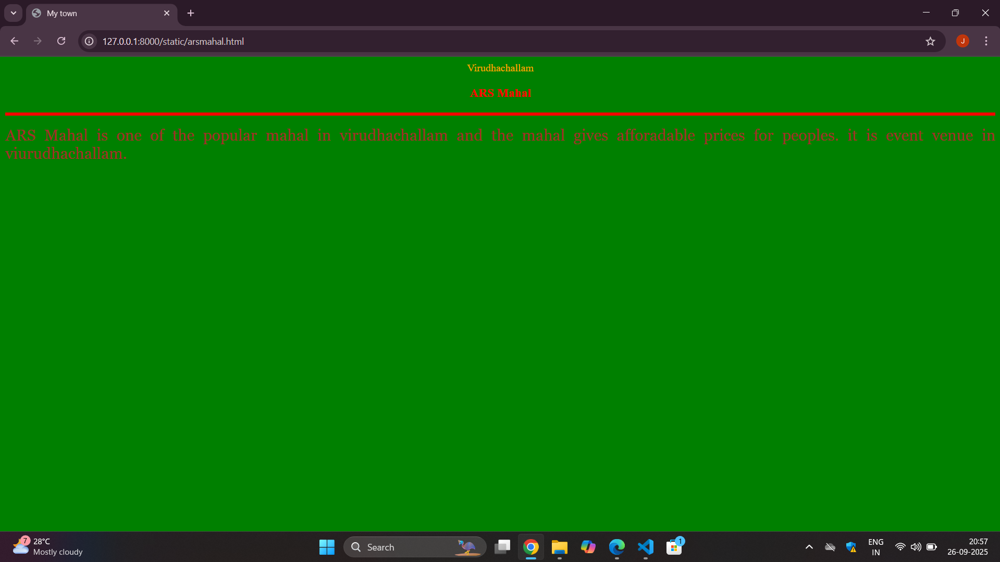
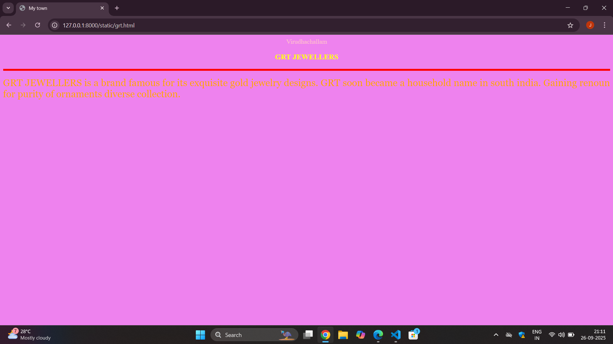
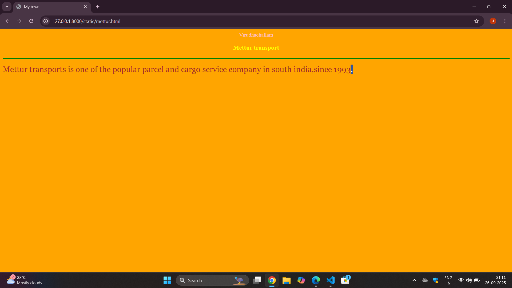
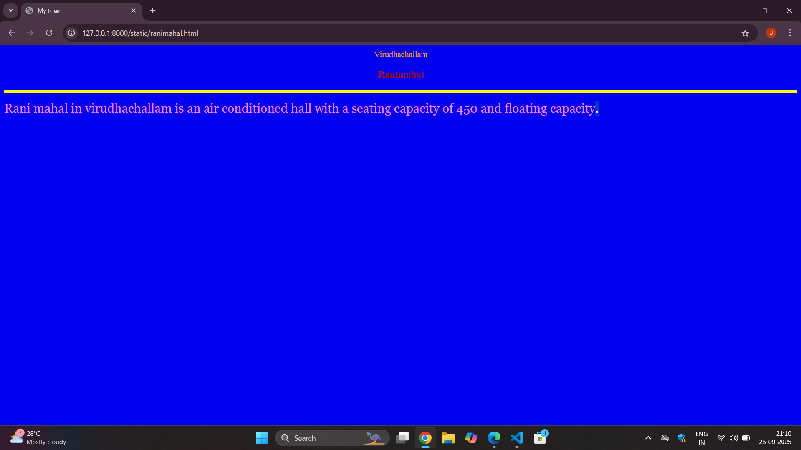
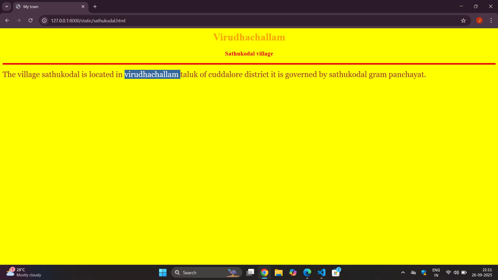

# Ex04 Places Around Me
## Date: 26/09/25

## AIM
To develop a website to display details about the places around my house.

## DESIGN STEPS

### STEP 1
Create a Django admin interface.

### STEP 2
Download your city map from Google.

### STEP 3
Using ```<map>``` tag name the map.

### STEP 4
Create clickable regions in the image using ```<area>``` tag.

### STEP 5
Write HTML programs for all the regions identified.

### STEP 6
Execute the programs and publish them.

## CODE
```
map.html
<html>
<head>
<title>My City</title>
</head>
<body>
<h1 align="center"    
<font color="blue"<b>Virudhachallam</b></font>
</h1>
<h3 align="center"
<font color="pink"<b> HARSHINI J (25011612)</b><font>
</h3> 
<center>



<map name="image-map">
    <area target="" alt="Ars mahal" title="Ars mahal" href="arsmahal.html" coords="1015,707,1157,757" shape="rect">
    <area target="" alt="Rani mahal" title="Rani mahal" href="ranimahal.html" coords="1200,429,60" shape="circle">
    <area target="" alt="Mettur transports" title="Mettur transports" href="mettur.html" coords="981,265,1048,260,1176,311,1055,341,990,341,906,310" shape="poly">
    <area target="" alt="sathkudal " title="sathkudal " href="sathukudal.html" coords="454,698,90" shape="circle">
    <area target="" alt="Grt jewellers" title="Grt jewellers" href="grt.html" coords="451,214,602,312" shape="rect">
</map>
</map>    
</center>   
</body>
</html>

arsmahal.html
<html>
    <head>
        <title>My town</title>
    </head>
<body bgcolor="green" 
<h1 align="center">
<font color="orange"<b>Virudhachallam</b></font>    
</h1> 
<h3 align="center">
<font color="red"><b>ARS Mahal</b></font> 
</h3>
<hr size="5" color="red"> 
<p align="justify">
<font face="georgia" size="5" color="brown">
      ARS Mahal is one of the popular mahal in virudhachallam
      and the mahal gives afforadable prices for peoples. 
      it is event venue in viurudhachallam. 
        
  </font>
  </p>
  </body>
</html>


grt.html
<html>
    <head>
        <title>My town</title>
    </head>
<body bgcolor="violet" 
<h1 align="center">
<font color="pink"<b>Virudhachallam</b></font>    
</h1> 
<h3 align="center">
<font color="yellow"><b>GRT JEWELLERS</b></font> 
</h3>
<hr size="5" color="red"> 
<p align="justify">
<font face="georgia" size="5" color="orange">
      GRT JEWELLERS is a brand famous for its exquisite gold jewelry designs.
      GRT soon became a household name in south india.
      Gaining renoun for purity of ornaments diverse collection.
        
  </font>
  </p>
  </body>
</html>

mettur.html
<html>
    <head>
        <title>My town</title>
    </head>
<body bgcolor="orange" 
<h1 align="center">
<font color="pink"<b>Virudhachallam</b></font>    
</h1> 
<h3 align="center">
<font color="yellow"><b>Mettur transport</b></font> 
</h3>
<hr size="5" color="green"> 
<p align="justify">
<font face="georgia" size="5" color="brown">
     Mettur transports is one of the popular parcel and cargo service company
     in south india,since 1993.

        
  </font>
  </p>
  </body>
</html>

ranimahal.html
<html>
    <head>
        <title>My town</title>
    </head>
<body bgcolor="light green" 
<h1 align="center">
<font color="orange"<b>Virudhachallam</b></font>    
</h1> 
<h3 align="center">
<font color="navy blue"><b>Ranimahal</b></font> 
</h3>
<hr size="5" color="yellow"> 
<p align="justify">
<font face="georgia" size="5" color="violet">
      Rani mahal in virudhachallam is an air conditioned hall with a seating
      capacity of 450 and floating capacity. 
        
  </font>
  </p>
  </body>
</html>

sathukodal.html
<html>
    <head>
        <title>My town</title>
    </head>
<body bgcolor="yellow">
<h1 align="center">
<font color="orange"<b>Virudhachallam</b></font>    
</h1> 
<h3 align="center">
<font color="red"><b>Sathukodal village</b></font> 
</h3>
<hr size="5" color="red"> 
<p align="justify">
<font face="georgia" size="5" color="brown">
       The village sathukodal is located in virudhachallam taluk of cuddalore district
       it is governed by sathukodal gram panchayat.
        
  </font>
  </p>
  </body>
</html>

```







## RESULT
The program for implementing image maps using HTML is executed successfully.
